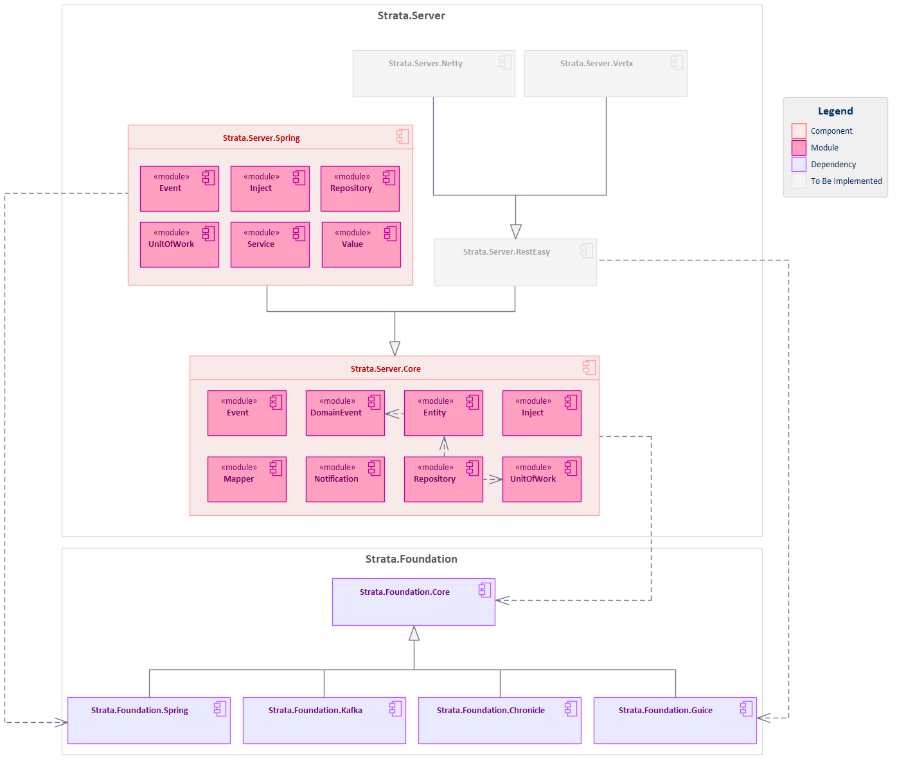

# Strata.Server

[](https://opensource.org/licenses/Apache-2.0)
[]()
[]()

Server-side components and utilities for building robust, scalable enterprise server applications in the Strata Framework Set. This library provides core server abstractions, Spring Framework integration, ORM mappings, and enterprise patterns for building high-performance server applications.

## Purpose
- Provide a unified developer experience across popular frameworks, libraries, and language platforms.
- Reduce impedance mismatch between different technologies.
- Facilitate rapid development of enterprise-grade applications with best practices and design patterns.

## Features

- **Server Core Abstractions**: Essential interfaces and utilities for enterprise server application development
- **Spring Framework Integration**: Enhanced Spring Boot compatibility with custom configurations and beans
- **ORM Integration**: Comprehensive object-relational mapping support with Hibernate and JPA
- **Event-Driven Architecture**: Server-side event handling and messaging capabilities
- **Entity Management**: Advanced entity lifecycle management and persistence patterns
- **Address Management**: Standardized postal address handling and validation
- **Testing Support**: Comprehensive testing utilities and fixtures for server components

## Architecture

The Strata.Server framework follows a modular architecture with clear separation of concerns:



Each component builds upon the core server abstractions while providing specialized functionality for specific server-side use cases and enterprise patterns.

## Components

### Strata.Server.Core

The foundational server component that provides essential abstractions and utilities for enterprise server application development:

**Modules:**
- `strata.server.core.entity` - Entity abstractions and lifecycle management
  - IEntity interface for primary key and version management
  - AbstractEntity base class with common entity functionality
  - AbstractEntityAndDomainEventSource for entities with domain event support
- `strata.server.core.repository` - Repository pattern implementations
  - IRepository interface for CRUD operations and querying
  - AbstractRepository base class with common repository functionality
  - Generic repository support for entity persistence and retrieval
- `strata.server.core.unitofwork` - Unit of Work pattern implementation
  - IUnitOfWork interface for transaction boundary management
  - IUnitOfWorkManager for unit of work lifecycle control
  - IUnitOfWorkSynchronizationManager for transaction synchronization
  - AbstractUnitOfWorkSynchronizationManager base implementation
- `strata.server.core.domainevent` - Domain event handling abstractions
  - IDomainEvent interface for domain event definitions
  - IDomainEventSource for entities that publish domain events
  - IDomainEventObserver for domain event handling and processing
- `strata.server.core.mapper` - Value object conversion utilities
  - StringToEmailAddressConverter and EmailAddressToStringConverter
  - StringToPhoneNumberConverter and PhoneNumberToStringConverter
  - Bidirectional mapping support for common value objects
- `strata.server.core.notification` - Email notification abstractions
  - IEmailMessage interface for email message definitions
  - IEmailMessageBuilder for constructing email messages
  - IEmailMessageSender for email delivery
  - IAttachment interface for email attachments

### Strata.Server.Spring

Spring Framework integration component that extends server core abstractions with Spring-specific implementations:

**Modules:**
- `strata.server.spring.inject` - Enhanced Spring dependency injection
  - RequestScope, ReactiveRequestScope for request-scoped beans
  - RequestOrThreadScope, RequestOrOperationScope for flexible scoping
  - Request annotation and IRequestProvider for request context management
  - RequestModule for Guice integration with Spring request handling
  - RequestAttributeMap for request attribute management
  - ReactiveRequestContextFilter for reactive web applications
  - TransientRequestProvider for stateless request handling
- `strata.server.spring.event` - Spring event integration and execution
  - OnCommitEventSender for transaction-aware event publishing
  - IExecutorAction and ExecutorAction for asynchronous action execution
  - ExecutorServiceAction for thread pool-based action processing
- `strata.server.spring.service` - Service layer integration
  - ServiceConfiguration for Spring service setup
  - ServiceReplyHttpMessageConverter for HTTP response handling
- `strata.server.spring.unitofwork` - Spring transaction integration
  - ISpringUnitOfWorkManager for Spring-aware unit of work management
- `strata.server.spring.value` - Value object Spring converters
  - EmailAddressConverter for Spring property conversion
  - PhoneNumberConverter for phone number formatting and parsing
  - PersonNameConverter for person name handling

**ORM Mappings:**
- `Entity.orm.xml` - Base entity mapping configurations
- `PostalAddress.orm.xml` - Standardized postal address entity mapping

**Testing Support:**
- Spring Boot test configurations
- Integration test utilities
- Mock server components
- Test application contexts

## Installation

### Gradle

Add the following dependencies to your `build.gradle`:

```gradle
dependencies {
    implementation 'strata.server:strata-server-core:1.0-SNAPSHOT'
    implementation 'strata.server:strata-server-spring:1.0-SNAPSHOT'
    
    // For testing
    testImplementation 'strata.server:strata-server-core-test:1.0-SNAPSHOT'
    testImplementation 'strata.server:strata-server-spring-test:1.0-SNAPSHOT'
}
```

### Maven

Add the following dependencies to your `pom.xml`:

```xml
<dependencies>
    <dependency>
        <groupId>strata.server</groupId>
        <artifactId>strata-server-core</artifactId>
        <version>1.0-SNAPSHOT</version>
    </dependency>
    <dependency>
        <groupId>strata.server</groupId>
        <artifactId>strata-server-spring</artifactId>
        <version>1.0-SNAPSHOT</version>
    </dependency>
    
    <!-- For testing -->
    <dependency>
        <groupId>strata.server</groupId>
        <artifactId>strata-server-core-test</artifactId>
        <version>1.0-SNAPSHOT</version>
        <scope>test</scope>
    </dependency>
    <dependency>
        <groupId>strata.server</groupId>
        <artifactId>strata-server-spring-test</artifactId>
        <version>1.0-SNAPSHOT</version>
        <scope>test</scope>
    </dependency>
</dependencies>
```

### Repository Configuration

This package is published to GitHub Packages. Add the repository to your build configuration:

```gradle
repositories {
    maven {
        name "GitHubPackages"
        url "https://maven.pkg.github.com/StrataFrameworkSet/repository"
        credentials {
            username = project.findProperty("gpr.user") ?: System.getenv("USERNAME")
            password = project.findProperty("gpr.key") ?: System.getenv("TOKEN")
        }
    }
}
```

## Usage

### Basic Server Application Setup

```java
import strata.server.core.entity.Entity;
import strata.server.core.repository.Repository;

// Define your domain entities
@Entity
public class Customer extends Entity {
    private String name;
    private String email;
    
    // constructors, getters, setters
}

// Implement repository pattern
public interface CustomerRepository extends Repository<Customer> {
    List<Customer> findByEmail(String email);
}
```

### Spring Boot Integration

```java
import org.springframework.boot.SpringApplication;
import org.springframework.boot.autoconfigure.SpringBootApplication;
import strata.server.spring.configuration.StrataServerConfiguration;

@SpringBootApplication
@Import(StrataServerConfiguration.class)
public class MyServerApplication {
    public static void main(String[] args) {
        SpringApplication.run(MyServerApplication.class, args);
    }
}
```

### Domain Event Handling

```java
import strata.server.core.domainevent.IDomainEvent;
import strata.server.core.domainevent.IDomainEventObserver;

@Service
public class OrderService {
    
    @Autowired
    private IDomainEventObserver eventObserver;
    
    @Transactional
    public void processOrder(Order order) {
        // Process the order
        orderRepository.save(order);
        
        // Publish domain event
        IDomainEvent event = new OrderProcessedEvent(order);
        eventObserver.notify(event);
    }
}
```

### Postal Address Management

```java
import strata.server.spring.entity.PostalAddress;

// Use standardized postal address entity
@Entity
public class CustomerAddress {
    @Embedded
    private PostalAddress address;
    
    // Address validation and formatting
    public boolean isValidAddress() {
        return address.isValid();
    }
    
    public String getFormattedAddress() {
        return address.getFormattedAddress();
    }
}
```

### Testing with Server Test Utilities

```java
import strata.server.core.test.ServerTestBase;
import strata.server.spring.test.SpringServerTest;

@SpringServerTest
public class CustomerServiceTest extends ServerTestBase {
    
    @Autowired
    private CustomerService customerService;
    
    @Test
    public void testCustomerCreation() {
        // Use test fixtures and utilities
        Customer customer = createTestCustomer();
        Customer saved = customerService.save(customer);
        
        assertThat(saved.getId()).isNotNull();
        assertThat(saved.getName()).isEqualTo(customer.getName());
    }
}
```

## Building

### Prerequisites

- Java 11 or higher
- Gradle 7.0 or higher

### Build Commands

```bash
# Build all components
./gradlew build

# Run tests
./gradlew test

# Publish to local repository
./gradlew publishToMavenLocal

# Publish to GitHub Packages (requires credentials)
./gradlew publish
```

### Project Structure

```
Strata.Server/
├── Components/
│   ├── Strata.Server.Core/          # Core server abstractions and utilities
│   └── Strata.Server.Spring/        # Spring Framework integration
├── Tests/
│   ├── Strata.Server.CoreTest/      # Core component tests and fixtures
│   └── Strata.Server.SpringTest/    # Spring integration tests
├── build.gradle                     # Root build configuration
├── settings.gradle                  # Gradle settings
└── README.md                        # This file
```

## Contributing

We welcome contributions to the Strata.Server project! Please follow these guidelines:

1. **Fork the repository** and create your feature branch from `development`
2. **Follow the coding standards** established in the existing codebase
3. **Write tests** for your changes and ensure all existing tests pass
4. **Update documentation** as needed for your changes
5. **Submit a pull request** with a clear description of your changes

### Development Setup

1. Clone the repository:
   ```bash
   git clone https://github.com/StrataFrameworkSet/Strata.Server.git
   cd Strata.Server
   ```

2. Build the project:
   ```bash
   ./gradlew build
   ```

3. Run tests to ensure everything works:
   ```bash
   ./gradlew test
   ```

### Code Style

- Follow Java naming conventions
- Use meaningful variable and method names
- Add appropriate JavaDoc comments for public APIs
- Maintain consistent indentation and formatting
- Write comprehensive unit tests for new functionality

## License

This project is licensed under the Apache License 2.0 - see the [LICENSE](LICENSE) file for details.

## Support

For questions, issues, or contributions, please:

1. Check the [Issues](https://github.com/StrataFrameworkSet/Strata.Server/issues) page for existing questions
2. Create a new issue if your question hasn't been addressed
3. For development discussions, join our community channels

## Related Projects

- [Strata.Foundation](https://github.com/StrataFrameworkSet/Strata.Foundation) - Foundational components and utilities
- [Strata.Client](https://github.com/StrataFrameworkSet/Strata.Client) - Client-side components and utilities

---

**Strata.Server** is part of the Strata Framework Set, providing enterprise-grade server-side components for building scalable, maintainable applications.
